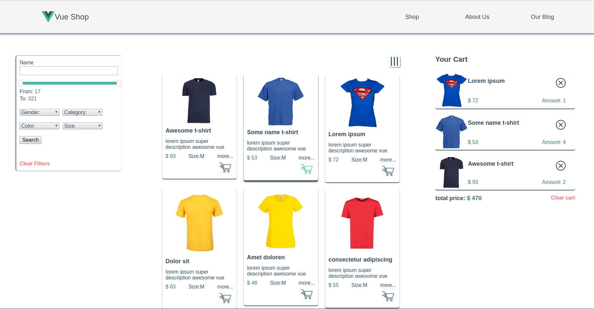

# vue-shop

## Project setup
```
npm install
```

### Compiles and hot-reloads for development
```
npm run serve
```

### Compiles and minifies for production
```
npm run build
```

### Lints and fixes files
```
npm run lint
```

### Customize configuration
See [Configuration Reference](https://cli.vuejs.org/config/).

### Deacription
Shop-website. Single Page Application. Vue, Vue CLI environment, Vuex, Vue-Router, API-based with Node.js, single file component aproach. With filters, flexbox, scss, lazy-load, preloaders, shoping-cart. Responsive to every user's display, support browser history, synchronize with url-parameters. Ability to customize view.


### P.S.
If you type npm run build and just double-click index.html in /build directory, its will does not work, because data must be transferred via http requests. In real production development everything will be okay )
